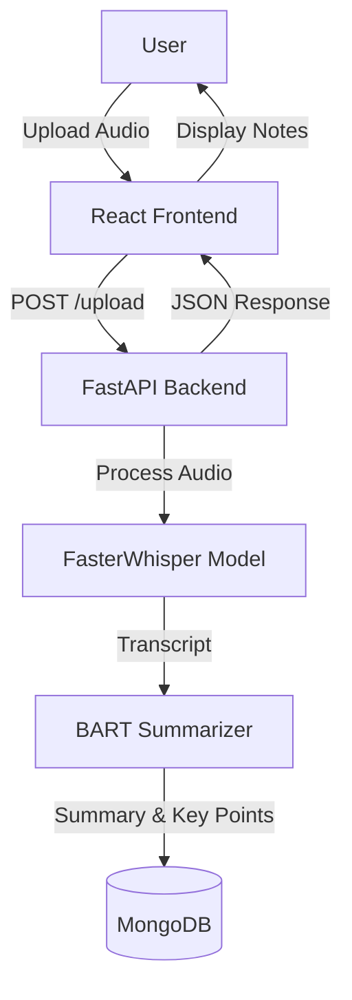

# Lecture Genie (Lecture Voice-to-Notes Generator)

Lecture Genie is a powerful full-stack application designed to transform lecture audio into structured notes, summaries, and quizzes. By leveraging advanced AI models for Automatic Speech Recognition (ASR) and Natural Language Processing (NLP), it helps students and professionals retain information more effectively.

## 🏗️ System Architecture & Flow

The application follows a modern client-server architecture, processing audio through a pipeline of AI models.



### Detailed Workflow
1.  **Upload**: The user uploads an audio file (mp3, wav, m4a, etc.) via the React frontend.
2.  **Processing**: The file is sent to the FastAPI backend.
3.  **Transcription**: **FasterWhisper** converts the speech to text, handling pauses and different accents with high accuracy.
4.  **Analysis**: The transcript is passed to the **BART-large-CNN** model, which generates a concise summary and extracts key bullet points.
5.  **Storage**: The original audio metadata, transcript, and generated notes are stored in **MongoDB** for future access.
6.  **Display**: The frontend displays the transcript, summary, and generated quiz questions to the user.

## 🛠️ Tech Stack

### Frontend
-   **Framework**: [React](https://react.dev/) + [Vite](https://vitejs.dev/)
-   **Styling**: [Tailwind CSS](https://tailwindcss.com/)
-   **UI Components**: [Shadcn/UI](https://ui.shadcn.com/)
-   **Icons**: [Lucide React](https://lucide.dev/)
-   **State Management**: React Query (TanStack Query)

### Backend
-   **Framework**: [FastAPI](https://fastapi.tiangolo.com/)
-   **ASR Model**: [FasterWhisper](https://github.com/SYSTRAN/faster-whisper) (4x faster than OpenAI Whisper)
-   **NLP Model**: [BART-large-CNN](https://huggingface.co/facebook/bart-large-cnn) (via Hugging Face Transformers)
-   **Server**: Uvicorn
-   **Database**: [MongoDB](https://www.mongodb.com/) (Motor async driver)

## 📂 Project Structure

```
root/
├── backend/                 # FastAPI application
│   ├── app/                 # Source code (routes, models, logic)
│   ├── requirements.txt     # Python dependencies
│   ├── Dockerfile           # Backend container config
│   └── .env.example         # Environment variables template
├── lecture-genie-main/      # Frontend application
│   └── lecture-genie-main/  # React source code
│       ├── src/             # Components, pages, hooks
│       ├── package.json     # Node.js dependencies
│       └── vite.config.ts   # Vite configuration
└── README.md                # Project documentation
```

## 🚀 Getting Started

### Prerequisites

-   **Python 3.8+**
-   **Node.js 18+**
-   **MongoDB Cluster** (Atlas or local)

### Backend Setup

1.  Navigate to the backend directory:
    ```bash
    cd backend
    ```

2.  Create and activate a virtual environment:
    ```bash
    # Windows
    python -m venv venv
    venv\Scripts\activate

    # macOS/Linux
    python3 -m venv venv
    source venv/bin/activate
    ```

3.  Install dependencies:
    ```bash
    pip install -r requirements.txt
    ```
    *Note: This will install PyTorch, FasterWhisper, and Transformers.*

4.  Configure environment variables:
    -   Copy `.env.example` to `.env`.
    -   Update `MONGODB_URI` with your connection string.
    ```bash
    cp .env.example .env
    ```

5.  Run the server:
    ```bash
    uvicorn app.main:app --reload
    ```
    The API will start at `http://localhost:8000`.

### Frontend Setup

1.  Navigate to the frontend directory:
    ```bash
    cd lecture-genie-main/lecture-genie-main
    ```

2.  Install dependencies:
    ```bash
    npm install
    ```

3.  Start the development server:
    ```bash
    npm run dev
    ```
    The app will ideally run at `http://localhost:8080` or `http://localhost:5173`.

## ✨ Features Deep Dive

-   **Audio Transcription**: capable of handling long lecture files. Uses VAD (Voice Activity Detection) to skip silence, ensuring efficient processing.
-   **Smart Summarization**: Uses an abstractive summarization model (BART) to rewrite content concisely, rather than just extracting sentences.
-   **Key Points Extraction**: Automatically identifies the most important 5-10 concepts from the lecture for quick review.
-   **Quiz Generation**: Creates fill-in-the-blank style questions based on the content to test user understanding.
-   **History/Storage**: All processed lectures are saved to MongoDB, allowing users to revisit past notes at any time.

## 🔌 API Endpoints

Explore the full interactive API documentation at `http://localhost:8000/docs`.

-   `POST /api/lectures/upload`: Upload audio file for processing.
-   `GET /api/lectures`: Retrieve a list of all processed lectures.
-   `GET /api/lectures/{id}`: Get detailed notes for a specific lecture.
-   `DELETE /api/lectures/{id}`: Remove a lecture and its data.

## ❓ Troubleshooting

-   **MongoDB Connection Error**: Ensure your IP is whitelisted in MongoDB Atlas and the connection string in `.env` is correct.
-   **Missing Modules**: If you see `Module not found`, ensure your virtual environment is activated and you have run `pip install -r requirements.txt`.
-   **Model Download**: The first run will download AI models (~2GB). Ensure you have a stable internet connection.

---

**Built with ❤️ for better learning.**
